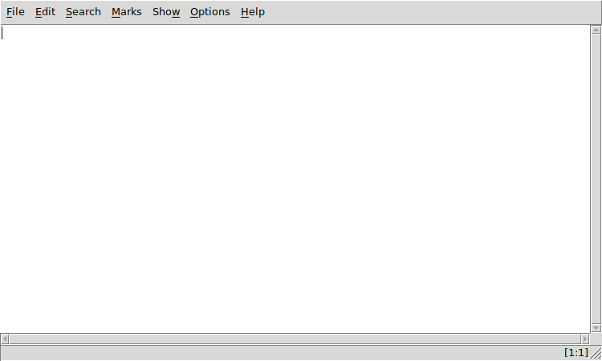

# tEdit
**tEdit** is a simple text editor written in [Tcl/Tk](https://www.tcl.tk).

Features:
* Word Wrap
* Mark Lines
* Line Spacing
* Line Numbers
* Custom Folding
* Unlimited Undo/Redo
* Customizable Tabstops
* Safe Mode (read only)
* Search/Replace supporting *Regular Expressions*
* Tabbed ScratchPad
* NerdTree like File Browser
* Customizable Colors and Fonts
* Runs in GNU/Linux, MS-Windows and Unix (MacOS not tested)

### Screenshot

## DEPENDENCIES
**Tcl** version 8.5 or later.

**Tk** version 8.5 or later.

##### For MS-Windows users:
[ActiveTcl](https://www.activestate.com/activetcl) version 8.5 or later.

## LICENSE
**tEdit** is licensed under the **MIT License**.

Read LICENSE for details.
