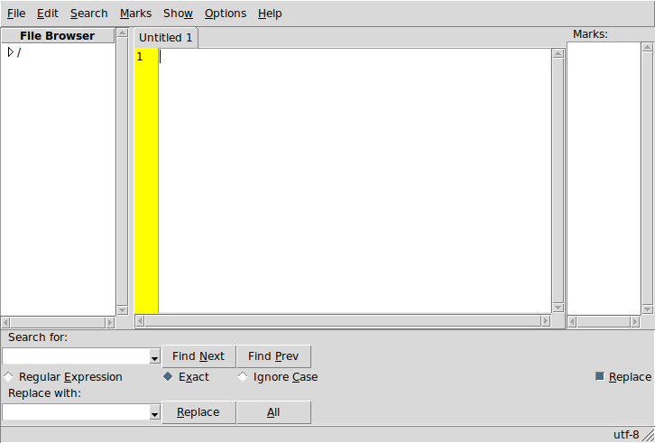

# tEdit
**tEdit** is a simple tabbed text editor written in core [Tcl/Tk](https://www.tcl.tk).

##### Features:
* Tabs
* Word Wrap
* Autoindent
* Mark Lines
* Line Numbers
* Custom Folding
* Block Selection
* Recent File List
* File Browser Panel
* Unlimited Undo/Redo
* Search/Replace with [Regular Expressions](https://www.tcl.tk/man/tcl/TclCmd/re_syntax.htm) support
* Tabs Menu (right mouse button)
* Rearrange Tabs (drag'n'drop)
* In-Text arithmetic calculations
* Tk Themes
* Colors and Fonts
* Customizable Tabs
* Spaces instead of Tabs
* Line Spacing (above/below lines and wraps)
* Base64 Encoder
* Command Line Support
* Runs in GNU/Linux, MS-Windows and Unix (MacOS not tested)

### Screenshot

## DEPENDENCIES
**Tcl** version 8.5 or later.

**Tk** version 8.5 or later.

##### For MS-Windows users:
[ActiveTcl](https://www.activestate.com/activetcl) version 8.5 or later.

## LICENSE
**tEdit** is licensed under the **MIT License**.

Read LICENSE for details.
